<!-- Copy and paste the converted output. -->

<!-----
NEW: Check the "Suppress top comment" option to remove this info from the output.

Conversion time: 6.306 seconds.


Using this Markdown file:

1. Paste this output into your source file.
2. See the notes and action items below regarding this conversion run.
3. Check the rendered output (headings, lists, code blocks, tables) for proper
   formatting and use a linkchecker before you publish this page.

Conversion notes:

* Docs to Markdown version 1.0β28
* Wed Jul 01 2020 11:43:08 GMT-0700 (PDT)
* Source doc: Semantic segmentation on the TACO Dataset
* Tables are currently converted to HTML tables.
* This document has images: check for >>>>>  gd2md-html alert:  inline image link in generated source and store images to your server. NOTE: Images in exported zip file from Google Docs may not appear in  the same order as they do in your doc. Please check the images!


WARNING:
You have 8 H1 headings. You may want to use the "H1 -> H2" option to demote all headings by one level.

----->


<p style="color: red; font-weight: bold">>>>>>  gd2md-html alert:  ERRORs: 0; WARNINGs: 1; ALERTS: 6.</p>
<ul style="color: red; font-weight: bold"><li>See top comment block for details on ERRORs and WARNINGs. <li>In the converted Markdown or HTML, search for inline alerts that start with >>>>>  gd2md-html alert:  for specific instances that need correction.</ul>

<p style="color: red; font-weight: bold">Links to alert messages:</p><a href="#gdcalert1">alert1</a>
<a href="#gdcalert2">alert2</a>
<a href="#gdcalert3">alert3</a>
<a href="#gdcalert4">alert4</a>
<a href="#gdcalert5">alert5</a>
<a href="#gdcalert6">alert6</a>

<p style="color: red; font-weight: bold">>>>>> PLEASE check and correct alert issues and delete this message and the inline alerts.<hr></p>


# Semantic segmentation on the TACO Dataset

<p float="left">

  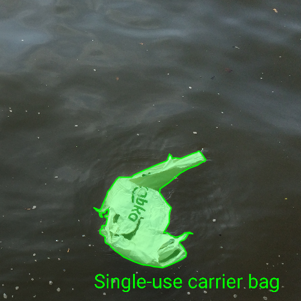

  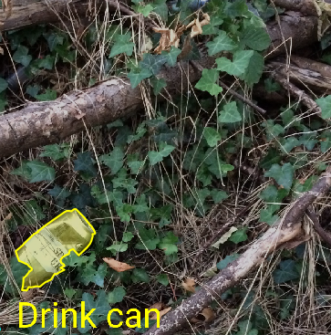 

  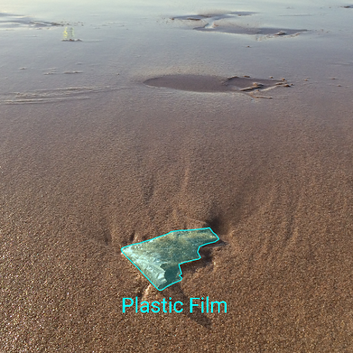

</p>

by: 

* Vera Hoveling, V.T.Hoveling@student.tudelft.nl, 4591941

* Sayra Ranjha S.S.Ranjha@student.tudelft.nl, 4555449

* Maaike Visser, M.E.B.P.Visser@student.tudelft.nl, 4597265


# Introduction

Although Pixar’s animators did surely not intend to lay out a roadmap to dystopia, since the release of WALL-E in 2008, we have steadily kept moving toward the hellscape that was painted in the feature film: a world covered in trash. Projections are that by 2025, we will produce double the amount of garbage that was produced in 2012[^1].

However, it is not quite time to despair _yet_. Progress was also made on another prominent feature of WALL-E’s world: robots! A plethora of waste-collecting robots and machinery is being developed [^2] [^3] [^4], in attempts to engineer ourselves out of our self-inflicted mess.

With this blog post, we hope to make our own small contribution. We investigate the performance of three popular image segmentation models on the task of segmenting images of various kinds of litter. In particular, we look at whether data augmentation can help these models perform better, without necessitating a larger base dataset.

Code and pre-trained models are available for evaluation purposes at [https://github.com/asylunatic/TACOS](https://github.com/asylunatic/TACOS). 


# TACO Dataset 

For this project, we use the TACO dataset[^5]. It is, in one word, trash. Literally: TACO stands for Trash Annotations in Context. It currently consists of 1500 photos of litter taken in diverse environments, with 4784 total annotations. Together these form, in the words of TACO’s creators, “an open image dataset of waste in the wild”. The dataset was set up without any funding, to enable AI to tackle waste-related environmental concerns. Think of drones surveying trash, anti-littering video surveillance, real-life WALL-Es roaming the streets.


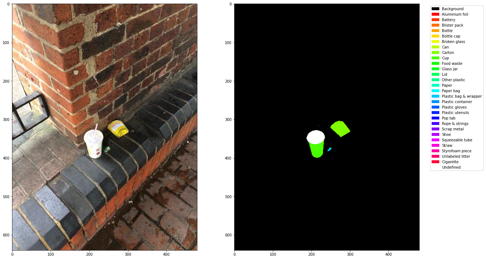


Figure 1: An example of an image from TACO with the corresponding segmentation mask.

TACO’s annotations are divided in 60 categories, of which 28 super (top) categories. It is important to note that there is a large class imbalance, both among the normal and the super categories. As you can see in Figure 2, there are more than 800 annotations of plastic bags and wrappers, but around 0 of batteries. Large class imbalances pose a challenge for deep learning models, because these models need enough examples of a class to learn a useful representation.

<p float="left">

  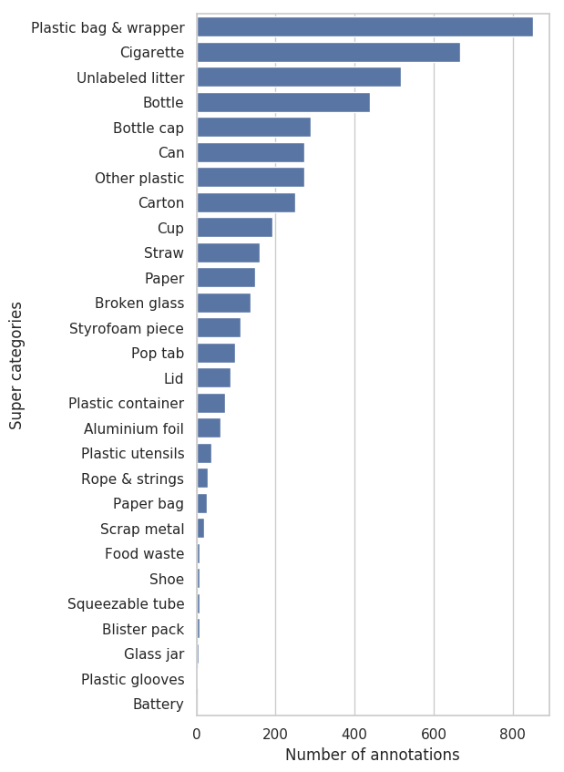

  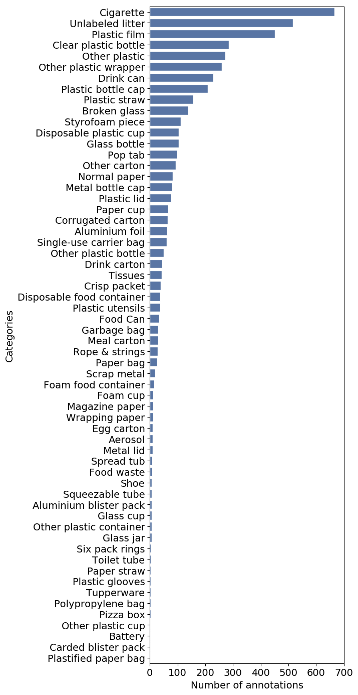

</p>

Figure 2: Number of annotations per (super) class in TACO. Image taken from [http://tacodataset.org/stats](http://tacodataset.org/stats).


## Pre-processing

TACO’s annotations are in the COCO format[^6] . However, none of the models we chose to investigate work with COCO images out-of-the-box. Therefore, some preprocessing steps were needed. We:


*   Reduced the resolution of the images such that their largest dimension is 640 pixels in size, while maintaining aspect ratios, to achieve feasible training times.
*   Generated segmentation masks. In the COCO format, masks are given as a string of coordinates. However, our models take in an image tensor.
*   Set class labels for “undefined” areas. Sometimes, an area in a mask can belong to multiple classes at the same time. This can lead to strange behavior, so we mark such areas with the label ‘255’, which is ignored at training time.


# DeepLab

DeepLab is a state-of-the-art convolutional neural network for semantic image segmentation that makes use of atrous (or dilated) convolution to increase the field-of-view of filters without increasing the computational cost or number of parameters[^7]. 

Specifically, we used a PyTorch implementation of the DeepLabV3 model with a ResNet-50 backbone. Initially, we used the ResNet-101 backbone, but due to memory constraints we had to switch to ResNet-50. The PyTorch model is pre-trained on a subset of COCO train2017, using the categories present in the Pascal VOC dataset[^8]. 

The model is fine-tuned on the TACO dataset using SGD with a learning rate of 0.001 and a learning rate policy of 0.001 * (1 - iterations / max iterations)^0.9[^7]. We used a batch size of 2 as opposed to the batch size of 16 used in the original paper due to memory constraints.


## Training


### Baseline - no augmentation

First, we fine-tuned DeepLabV3 on the TACO dataset as-is with no further data augmentation. While the training and validation losses were quite low (Figure 3), the performance on the individual classes left a lot to be desired. As can be seen in Table 1, the model performs extremely well on the background (IoU of 0.98), and achieved an IoU > 0.5 for the bottle, can, carton, and cup classes, which happen to be the most common classes. The remaining classes had a rather poor performance, with most not even being predicted at all. 

<p float="left">

  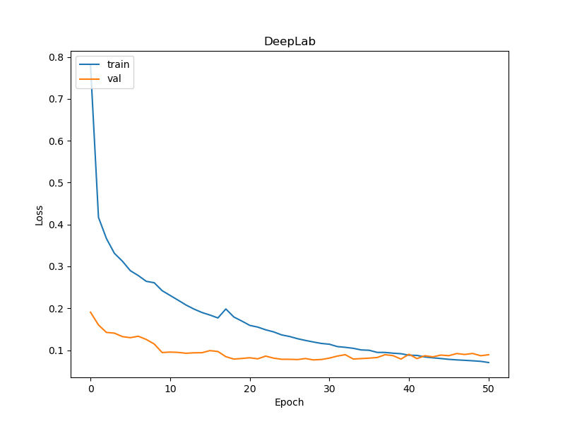

</p>

Figure 3: The learning curve of DeepLab, using no data augmentation.


### Data augmentation - random cropping

Hoping to improve performance, we gave random cropping a try. However, as you can see in the learning curve in Figure 4, the validation loss is all over the place. The results on the test set were similarly disappointing, with the mean IoU down to 0.09 and the IoU of each class being significantly worse than before. 

In this case, the validation samples were also randomly cropped. Thinking that this caused the irregular validation loss, we fine-tuned DeepLab again using random cropping, but now leaving the validation images intact. While the validation loss is now lower than before (see Figure 5), it is still irregular and not decreasing. The performance on the test set is now slightly better, and it traded the ability to poorly recognize paper for the ability to poorly recognize bottle caps instead. 

<p float="left">

  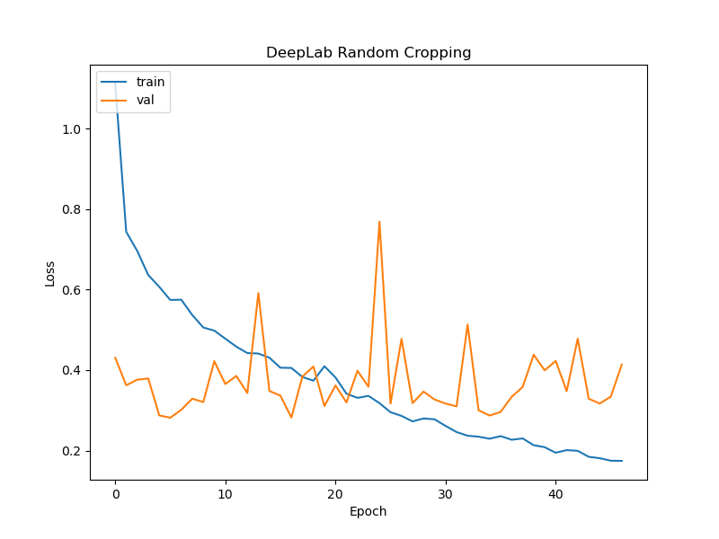

</p>

Figure 4: The learning curve of DeepLab when using random cropping.

<p float="left">

  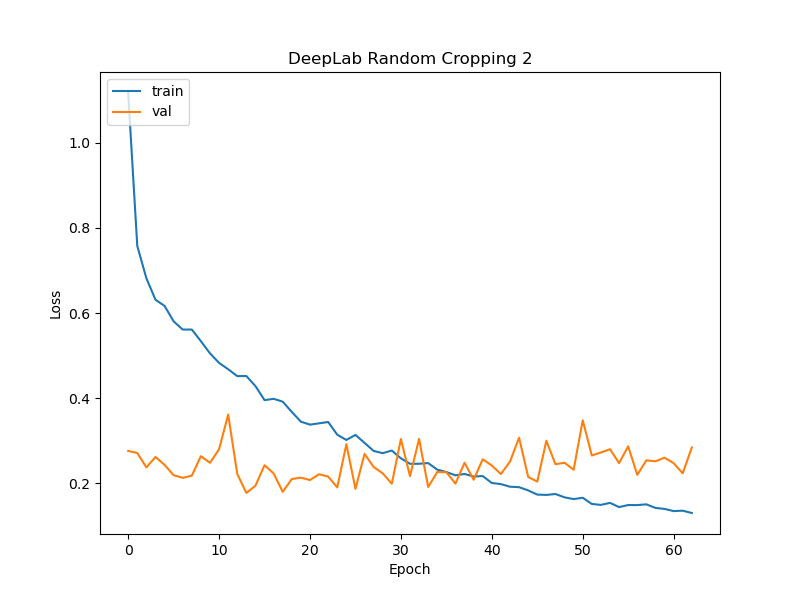

</p>

Figure 5: The learning curve of DeepLab using random cropping on training images, but not on the validation set.


### Weighted sampling

Desperate for improvement, we sought out other methods to counter the class imbalance of the TACO dataset. We tried a weighted cross-entropy loss using the inverse class frequencies as weights. This time, the validation loss curve was less irregular than before, but it was still unwilling to decrease. Although the performance on the test set is again worse than that of the first model, it is better than the random crop approaches. It also recognizes four more classes than the original model (bottle cap, lid, other plastic, and straw), where the IoU for bottle cap and other plastic is a respectable 0.14 and 0.16 respectively. While the IoU for other classes deteriorated, the IoU for plastic containers is at an all-time high of 0.50.  

<p float="left">

  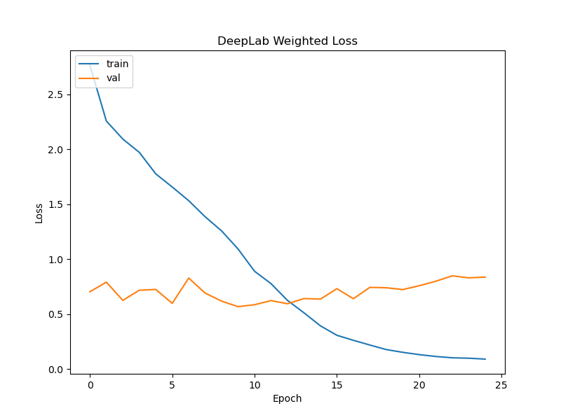

</p>

Figure 6: The learning curve of DeepLab when using weighted sampling.


### Data augmentations - more augmentations

As a final attempt to improve the performance of our DeepLab model on the TACO dataset, we decided to use the data augmentations as used by the authors of TACO in their Mask R-CNN implementation. These augmentations will be explained in more detail in the following section on Mask R-CNN. Unfortunately, again the performance of the model was poorer than that of the baseline model, as can be seen in Tables 1 and 2. 

<p float="left">

  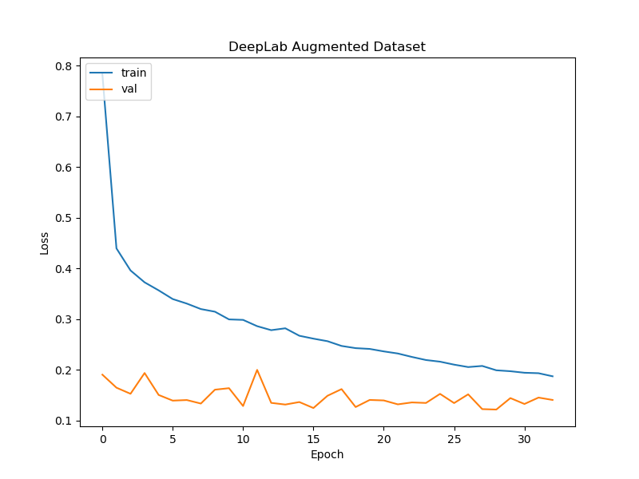

</p>

Figure 7: The learning curve of DeepLab when using data augmentation.


### Conclusion 

It is evident that the class imbalance of the TACO dataset is detrimental to the performance of DeepLab on most classes in the dataset, particularly the classes with very few images. What makes matters worse is that the background class makes up the vast majority of each image, with the actual objects taking up a fraction of the image. As a result, the model only learns to predict the background and a couple of the most common classes well, namely “plastic bag & wrapper”, “bottle”, “can”, and “carton”. Notably, the second and third most common classes, “cigarette” and “unlabeled litter”,  are not learned by any of the DeepLab variations. An explanation for this might be that the former class has extremely small objects, which might be difficult to discern from the background. As for the latter class, while the objects are often small as well, the largest problem is that “unlabeled litter” is a hodgepodge of all objects that do not fit in any other category. As such, the objects are likely not very similar to each other, which can make learning this class very difficult.

It is interesting to see in Table 2 that all forms of data augmentation resulted in a worse performance than the baseline model, which is in stark contrast to our expectations. Perhaps these forms of data augmentation are simply not fit for remedying the class imbalance in the TACO dataset. Other approaches to counter the imbalance more explicitly, such as over- or undersampling, could be tried in the future. 


<table>
  <tr>
   <td>
   </td>
   <td>Normal
   </td>
   <td>Random crop
   </td>
   <td>Random crop (no crop on validation set)
   </td>
   <td>Weighted loss
   </td>
   <td>Augmentation
   </td>
  </tr>
  <tr>
   <td>Background
   </td>
   <td>0.98497
   </td>
   <td>0.971271
   </td>
   <td>0.979263
   </td>
   <td>0.980206
   </td>
   <td>0.974956
   </td>
  </tr>
  <tr>
   <td>Aluminium foil
   </td>
   <td>0
   </td>
   <td>0
   </td>
   <td>0
   </td>
   <td>0
   </td>
   <td>0
   </td>
  </tr>
  <tr>
   <td>Battery
   </td>
   <td>0
   </td>
   <td>0
   </td>
   <td>0
   </td>
   <td>0
   </td>
   <td>0
   </td>
  </tr>
  <tr>
   <td>Blister pack
   </td>
   <td>0
   </td>
   <td>0
   </td>
   <td>0
   </td>
   <td>0
   </td>
   <td>0
   </td>
  </tr>
  <tr>
   <td>Bottle
   </td>
   <td>0.735247
   </td>
   <td>0.395908
   </td>
   <td>0.516769
   </td>
   <td>0.421527
   </td>
   <td>0.475709
   </td>
  </tr>
  <tr>
   <td>Bottle cap
   </td>
   <td>0
   </td>
   <td>0
   </td>
   <td>0.027382
   </td>
   <td>0.146449
   </td>
   <td>0
   </td>
  </tr>
  <tr>
   <td>Broken glass
   </td>
   <td>0
   </td>
   <td>0
   </td>
   <td>0
   </td>
   <td>0
   </td>
   <td>0
   </td>
  </tr>
  <tr>
   <td>Can
   </td>
   <td>0.555532
   </td>
   <td>0.080671
   </td>
   <td>0.438712
   </td>
   <td>0.319014
   </td>
   <td>0.12799
   </td>
  </tr>
  <tr>
   <td>Carton
   </td>
   <td>0.56346
   </td>
   <td>0.126214
   </td>
   <td>0.332544
   </td>
   <td>0.293334
   </td>
   <td>0.226212
   </td>
  </tr>
  <tr>
   <td>Cup
   </td>
   <td>0.253962
   </td>
   <td>0.041346
   </td>
   <td>0.037928
   </td>
   <td>0.092904
   </td>
   <td>0
   </td>
  </tr>
  <tr>
   <td>Food waste
   </td>
   <td>0
   </td>
   <td>0
   </td>
   <td>0
   </td>
   <td>0
   </td>
   <td>0
   </td>
  </tr>
  <tr>
   <td>Glass jar
   </td>
   <td>0
   </td>
   <td>0
   </td>
   <td>0
   </td>
   <td>0
   </td>
   <td>0
   </td>
  </tr>
  <tr>
   <td>Lid
   </td>
   <td>0
   </td>
   <td>0
   </td>
   <td>0
   </td>
   <td>0.075601
   </td>
   <td>0
   </td>
  </tr>
  <tr>
   <td>Other plastic
   </td>
   <td>0
   </td>
   <td>0
   </td>
   <td>0
   </td>
   <td>0.16305
   </td>
   <td>0
   </td>
  </tr>
  <tr>
   <td>Paper
   </td>
   <td>0.087936
   </td>
   <td>0.047733
   </td>
   <td>0
   </td>
   <td>0.017705
   </td>
   <td>0
   </td>
  </tr>
  <tr>
   <td>Paper bag
   </td>
   <td>0
   </td>
   <td>0
   </td>
   <td>0
   </td>
   <td>0
   </td>
   <td>0
   </td>
  </tr>
  <tr>
   <td>Plastic bag & wrapper
   </td>
   <td>0.484086
   </td>
   <td>0.122013
   </td>
   <td>0.279493
   </td>
   <td>0.20816
   </td>
   <td>0.159724
   </td>
  </tr>
  <tr>
   <td>Plastic container
   </td>
   <td>0.284191
   </td>
   <td>0.0000661310055219389
   </td>
   <td>0.174681315815212
   </td>
   <td>0.503665423817259
   </td>
   <td>0
   </td>
  </tr>
  <tr>
   <td>Plastic gloves
   </td>
   <td>0
   </td>
   <td>0
   </td>
   <td>0
   </td>
   <td>0
   </td>
   <td>0
   </td>
  </tr>
  <tr>
   <td>Plastic utensils
   </td>
   <td>0
   </td>
   <td>0
   </td>
   <td>0
   </td>
   <td>0
   </td>
   <td>0
   </td>
  </tr>
  <tr>
   <td>Pop tab
   </td>
   <td>0
   </td>
   <td>0
   </td>
   <td>0
   </td>
   <td>0
   </td>
   <td>0
   </td>
  </tr>
  <tr>
   <td>Rope & strings
   </td>
   <td>0
   </td>
   <td>0
   </td>
   <td>0
   </td>
   <td>0
   </td>
   <td>0
   </td>
  </tr>
  <tr>
   <td>Scrap metal
   </td>
   <td>0
   </td>
   <td>0
   </td>
   <td>0
   </td>
   <td>0
   </td>
   <td>0
   </td>
  </tr>
  <tr>
   <td>Shoe
   </td>
   <td>0
   </td>
   <td>0
   </td>
   <td>0
   </td>
   <td>0
   </td>
   <td>0
   </td>
  </tr>
  <tr>
   <td>Squeezable tube
   </td>
   <td>0
   </td>
   <td>0
   </td>
   <td>0
   </td>
   <td>0
   </td>
   <td>0
   </td>
  </tr>
  <tr>
   <td>Straw
   </td>
   <td>0
   </td>
   <td>0
   </td>
   <td>0
   </td>
   <td>0.081429
   </td>
   <td>0
   </td>
  </tr>
  <tr>
   <td>Styrofoam piece
   </td>
   <td>0.331968
   </td>
   <td>0.162418
   </td>
   <td>0.287194
   </td>
   <td>0.030135
   </td>
   <td>0
   </td>
  </tr>
  <tr>
   <td>Unlabeled litter
   </td>
   <td>0
   </td>
   <td>0
   </td>
   <td>0
   </td>
   <td>0
   </td>
   <td>0
   </td>
  </tr>
  <tr>
   <td>Cigarette
   </td>
   <td>0
   </td>
   <td>0
   </td>
   <td>0
   </td>
   <td>0
   </td>
   <td>0
   </td>
  </tr>
</table>


Table 1: The IoU for the different DeepLab models per class


<table>
  <tr>
   <td>
   </td>
   <td>Mean IoU
   </td>
   <td>Frequency weighted IoU
   </td>
   <td>Mean Accuracy
   </td>
   <td>Pixel Accuracy
   </td>
  </tr>
  <tr>
   <td>Normal
   </td>
   <td><strong>0.20387399306541715</strong>
   </td>
   <td><strong>0.9651476099846004</strong>
   </td>
   <td><strong>0.2515695525111232</strong>
   </td>
   <td><strong>0.980938604472134</strong>
   </td>
  </tr>
  <tr>
   <td>Random crop
   </td>
   <td>0.09274474882048157
   </td>
   <td>0.9393082019789044
   </td>
   <td>0.11035002293630625
   </td>
   <td>0.9667554270737567
   </td>
  </tr>
  <tr>
   <td>Random crop (no crop on validation set)
   </td>
   <td>0.1463793855147662
   </td>
   <td>0.9525940638522274
   </td>
   <td>0.18911111717251386
   </td>
   <td>0.9730163166143371
   </td>
  </tr>
  <tr>
   <td>Weighted loss
   </td>
   <td>0.15872279081703652
   </td>
   <td>0.9527966536230024
   </td>
   <td>0.23470755680019448
   </td>
   <td>0.9691538754546601
   </td>
  </tr>
  <tr>
   <td>Augmentation
   </td>
   <td>0.09355192318774178
   </td>
   <td>0.9445820960428954
   </td>
   <td>0.10903049915810985
   </td>
   <td>0.967822758460111
   </td>
  </tr>
</table>


Table 2: The overall evaluation metrics for the different DeepLab models.


# Mask-RCNN

Mask R-CNN[^9] is a convolutional network used for object instance segmentation[^10]. It is built on top of Faster R-CNN[^11]. Faster R-CNN generates so-called Regions of Interest (ROIs) and searches for objects within these regions. For each recognized object, Faster R-CNN generates a bounding box. Mask R-CNN expands upon this approach by predicting an object mask as well.


## Implementation

We use Torchvision’s Mask R-CNN implementation[^12] (t-Mask R-CNN). This implementation comes with a number of handy utility methods for training the model, and allows us to use PyTorch functionalities such as custom DataLoaders[^13]. Additionally, t-Mask R-CNN comes with a pre-trained ResNet50 backbone. The backbone extracts the feature map on which the ROIs are based. This particular backbone is pre-trained on the COCO 2017 dataset. 


## Training

During preprocessing we already generated segmentation masks from the TACO annotations. However, t-Mask R-CNN expects more. In the following, `H` is the height of the image, `W` is the width of the image, and `M` is the number of masks.


*   `image`: a `torch tensor` of size `(H, W)`
*   `target`: a `dict` containing the following fields:
    *   `boxes`: the coordinates of the `M` bounding boxes in `[x0, y0, x1, y1]` format, ranging from `0` to `W` and `0` to `H`
    *   `labels`: the label for each bounding box
    *   `image_id`: an image identifier
    *   `area`: the area of each bounding box
    *   `iscrowd`: instances with `iscrowd=True` will be ignored during evaluation.
    *   `masks`: the segmentation mask for each object

`boxes`, `labels`, and `area` are all calculated from the `masks`, `iscrowd` is always `False`, and `image_id` is given.

While it seems straightforward, training t-Mask R-CNN at first was not an easy feat. The loss of the network would invariably blow up to infinity, without clear cause. Inspecting images did not show a clear cause: there was no visual difference between images that were used in the network right before the loss blew up and images that were used earlier.

The problem turned out to be threefold:


1. Some images contain masks that are either zero width, height, or both. Since bounding boxes are computed from the masks, this leads to degenerate bounding boxes, which then causes the loss to explode.
2. Masks with label 255 (undefined) were not filtered out, but since there were supposed to be only 29 classes (28 superclasses plus background), when the model received a mask with label 255 it did not know what to do.
3. Some masks contained only the background class, likely because they originally contained very small masks that were lost during the resolution reduction. t-Mask R-CNN was not able to deal with these images.

At first, our solution was to filter out degenerate boxes and masks with label 255 at load time. However, at times this led to case three: images with no masks whatsoever. Therefore, we resorted to computing all the valid TACO images at once, and passing only the valid images to a DataLoader. The dataset suitable for Mask R-CNN consisted of 1285 images.


## Experiments


### Evaluation metric

The Torchvision detection package that t-Mask R-CNN belongs to comes with some useful utility methods for training and evaluation. The `evaluate` method returns the _average precision_ and _average recall_ over a given set of images at different thresholds and for different bounding box sizes. For a good explanation of these metrics, see [this blog post](https://blog.zenggyu.com/en/post/2018-12-16/an-introduction-to-evaluation-metrics-for-object-detection/). For now, it is enough to know that the _precision_ is a measure of how many true positive detections the network generated, divided by the sum of all true and false positives. In other words, what fraction of detections by the network is a _real_ detection?

_Recall_ is defined as the number of true positives divided by the sum of the true positives and the false negatives. In other words: how many of the positive examples is the network able to retrieve? If you need a more intuitive illustration of precision and recall, click [here](https://medium.com/@formigone/intuitive-explanation-of-precision-and-recall-c6fba316afbe).

For the more programmatically inclined among you, this pseudocode snippet may give some clarification.

```
def precision(tp, fp):
   return tp / (tp + fp)

def recall(tp, fn)
   return tp / (tp + fn)
```

Whether or not an example counts as a true or a false positive depends on your _decision threshold_. _Average precision_ and _average recall_ are the precision and recall averaged over all relevant decision thresholds.

For an even more intuitive take: there is a tradeoff between precision and recall, but in general higher is better.


### Untrained

As a baseline, it is interesting to see how t-Mask R-CNN performs without any fine-tuning.


<table>
  <tr>
   <td>Metric
   </td>
   <td>IoU
   </td>
   <td>Area
   </td>
   <td>Max # of detections
   </td>
   <td>Value
   </td>
  </tr>
  <tr>
   <td>Average Precision
   </td>
   <td>0.50:0.95 
   </td>
   <td>all
   </td>
   <td>100
   </td>
   <td>0.000
   </td>
  </tr>
  <tr>
   <td>AP
   </td>
   <td>0.50
   </td>
   <td>all
   </td>
   <td>100
   </td>
   <td>0.000
   </td>
  </tr>
  <tr>
   <td>AP
   </td>
   <td>0.75
   </td>
   <td>all
   </td>
   <td>100
   </td>
   <td>0.000
   </td>
  </tr>
  <tr>
   <td>AP
   </td>
   <td>0.50:0.95 
   </td>
   <td>small
   </td>
   <td>100
   </td>
   <td>0.000
   </td>
  </tr>
  <tr>
   <td>AP
   </td>
   <td>0.50:0.95 
   </td>
   <td>medium
   </td>
   <td>100
   </td>
   <td>0.000
   </td>
  </tr>
  <tr>
   <td>AP
   </td>
   <td>0.50:0.95 
   </td>
   <td>large
   </td>
   <td>100
   </td>
   <td>0.000
   </td>
  </tr>
  <tr>
   <td>Average Recall
   </td>
   <td>0.50:0.95 
   </td>
   <td>all
   </td>
   <td>1
   </td>
   <td>0.000
   </td>
  </tr>
  <tr>
   <td>AR
   </td>
   <td>0.50:0.95 
   </td>
   <td>all
   </td>
   <td>10
   </td>
   <td>0.000
   </td>
  </tr>
  <tr>
   <td>AR
   </td>
   <td>0.50:0.95 
   </td>
   <td>all
   </td>
   <td>100
   </td>
   <td>0.000
   </td>
  </tr>
  <tr>
   <td>AR
   </td>
   <td>0.50:0.95 
   </td>
   <td>small
   </td>
   <td>100
   </td>
   <td>0.000
   </td>
  </tr>
  <tr>
   <td>AR
   </td>
   <td>0.50:0.95 
   </td>
   <td>medium
   </td>
   <td>100
   </td>
   <td>0.000
   </td>
  </tr>
  <tr>
   <td>AR
   </td>
   <td>0.50:0.95 
   </td>
   <td>large
   </td>
   <td>100
   </td>
   <td>0.000
   </td>
  </tr>
</table>


Table 3: The performance of Mask R-CNN before fine-tuning.

As you can see, the answer is: not very well. The average precision and recall are 0 at any threshold or bounding box size. If we look at some predicted masks we also see that they are not accurate.


<p id="gdcalert2" ><span style="color: red; font-weight: bold">>>>>>  gd2md-html alert: inline image link here (to images/image2.png). Store image on your image server and adjust path/filename/extension if necessary. </span><br>(<a href="#">Back to top</a>)(<a href="#gdcalert3">Next alert</a>)<br><span style="color: red; font-weight: bold">>>>>> </span></p>


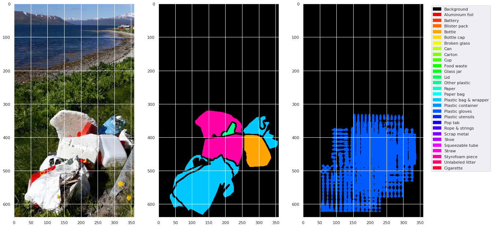
Figure 8: An image, mask, and predicted mask from the untrained Mask R-CNN.


The network can already see that there is _something_, but what that something is, it hasn’t yet learned!


### 30 epochs

Next, we train for 30 epochs. We used a 80/10/10 training/validation/testing split. The results are already better. Recall and precision are still both low, but at least no longer zero!


<table>
  <tr>
   <td>Metric
   </td>
   <td>IoU
   </td>
   <td>Area
   </td>
   <td>Max # of detections
   </td>
   <td>Value
   </td>
  </tr>
  <tr>
   <td>Average Precision
   </td>
   <td>0.50:0.95 
   </td>
   <td>all
   </td>
   <td>100
   </td>
   <td>0.030
   </td>
  </tr>
  <tr>
   <td>AP
   </td>
   <td>0.50
   </td>
   <td>all
   </td>
   <td>100
   </td>
   <td>0.051
   </td>
  </tr>
  <tr>
   <td>AP
   </td>
   <td>0.75
   </td>
   <td>all
   </td>
   <td>100
   </td>
   <td>0.031
   </td>
  </tr>
  <tr>
   <td>AP
   </td>
   <td>0.50:0.95 
   </td>
   <td>small
   </td>
   <td>100
   </td>
   <td>0.011
   </td>
  </tr>
  <tr>
   <td>AP
   </td>
   <td>0.50:0.95 
   </td>
   <td>medium
   </td>
   <td>100
   </td>
   <td>0.075
   </td>
  </tr>
  <tr>
   <td>AP
   </td>
   <td>0.50:0.95 
   </td>
   <td>large
   </td>
   <td>100
   </td>
   <td>0.049
   </td>
  </tr>
  <tr>
   <td>Average Recall
   </td>
   <td>0.50:0.95 
   </td>
   <td>all
   </td>
   <td>1
   </td>
   <td>0.117
   </td>
  </tr>
  <tr>
   <td>AR
   </td>
   <td>0.50:0.95 
   </td>
   <td>all
   </td>
   <td>10
   </td>
   <td>0.154
   </td>
  </tr>
  <tr>
   <td>AR
   </td>
   <td>0.50:0.95 
   </td>
   <td>all
   </td>
   <td>100
   </td>
   <td>0.155
   </td>
  </tr>
  <tr>
   <td>AR
   </td>
   <td>0.50:0.95 
   </td>
   <td>small
   </td>
   <td>100
   </td>
   <td>0.079
   </td>
  </tr>
  <tr>
   <td>AR
   </td>
   <td>0.50:0.95 
   </td>
   <td>medium
   </td>
   <td>100
   </td>
   <td>0.301
   </td>
  </tr>
  <tr>
   <td>AR
   </td>
   <td>0.50:0.95 
   </td>
   <td>large
   </td>
   <td>100
   </td>
   <td>0.140
   </td>
  </tr>
</table>


Table 4: The performance of Mask R-CNN after being fine-tuned for 30 epochs.

The network is learning! Some output:


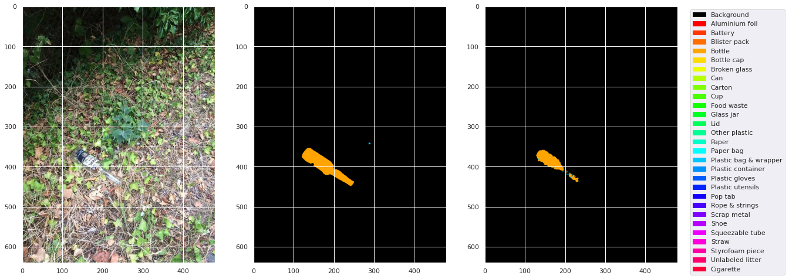
Figure 9: An image, mask, and predicted mask predicted by Mask R-CNN trained on the dataset for 30 epochs.

Some observations: the network is mainly good at predicting when there is one large-ish object in the image, and it mainly predicts bottles and plastic bags and wrappers. This is not so strange, because as we can see from Figure 2, these are some of the most common classes.


### Augmented 17 epochs

At this point in time, we wanted to see whether using data augmentation could improve the predictions of our model. We had seen that for DeepLab, random cropping alone did not help to improve the results much. Therefore, we added more augmentations: additive Gaussian noise, Gaussian blur, a horizontal flip (applied with probability 0.5) and a vertical flip (applied with probability 0.5). These augmentations are also used by the authors of TACO in their own implementation of Mask R-CNN, and correspond to variations you would also expect to see ‘in the wild’. Figure 10 shows an augmented and a non-augmented version of an image.


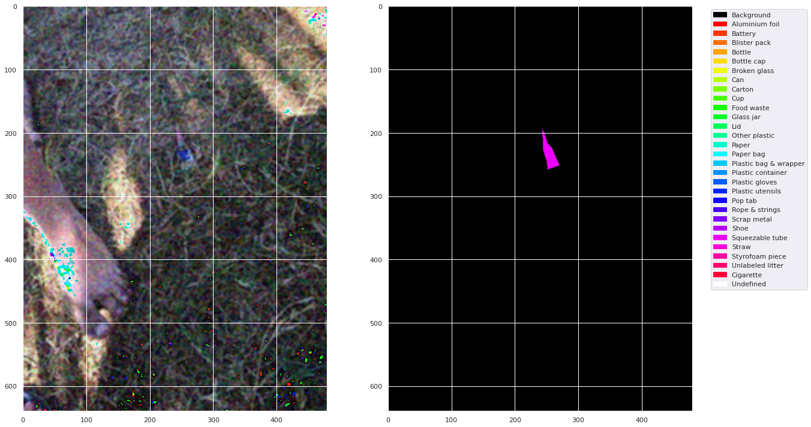
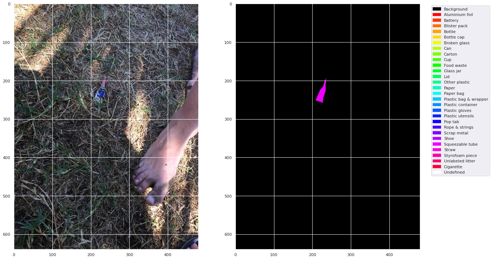
Figure 10: An augmented and non-augmented image side by side. The top image is augmented.

We trained the model for 17 epochs with data augmentations. Our goal was to train for 30 epochs again, but we found that for an unknown reason, Google Colab (where we trained our models) disconnected after 5-8 epochs. Therefore, in light of time, we eventually decided to stop training at 17 epochs. We feel this decision is justified, since the average precision and average recall had not improved in several epochs. The performance of the model trained with data augmentation can be seen in Table 5.


<table>
  <tr>
   <td>Metric
   </td>
   <td>IoU
   </td>
   <td>Area
   </td>
   <td>Max # of detections
   </td>
   <td>Value
   </td>
  </tr>
  <tr>
   <td>Average Precision
   </td>
   <td>0.50:0.95 
   </td>
   <td>all
   </td>
   <td>100
   </td>
   <td>0.026
   </td>
  </tr>
  <tr>
   <td>AP
   </td>
   <td>0.50
   </td>
   <td>all
   </td>
   <td>100
   </td>
   <td>0.045
   </td>
  </tr>
  <tr>
   <td>AP
   </td>
   <td>0.75
   </td>
   <td>all
   </td>
   <td>100
   </td>
   <td>0.025
   </td>
  </tr>
  <tr>
   <td>AP
   </td>
   <td>0.50:0.95 
   </td>
   <td>small
   </td>
   <td>100
   </td>
   <td>0.003
   </td>
  </tr>
  <tr>
   <td>AP
   </td>
   <td>0.50:0.95 
   </td>
   <td>medium
   </td>
   <td>100
   </td>
   <td>0.063
   </td>
  </tr>
  <tr>
   <td>AP
   </td>
   <td>0.50:0.95 
   </td>
   <td>large
   </td>
   <td>100
   </td>
   <td>0.058
   </td>
  </tr>
  <tr>
   <td>Average Recall
   </td>
   <td>0.50:0.95 
   </td>
   <td>all
   </td>
   <td>1
   </td>
   <td>0.083
   </td>
  </tr>
  <tr>
   <td>AR
   </td>
   <td>0.50:0.95 
   </td>
   <td>all
   </td>
   <td>10
   </td>
   <td>0.119
   </td>
  </tr>
  <tr>
   <td>AR
   </td>
   <td>0.50:0.95 
   </td>
   <td>all
   </td>
   <td>100
   </td>
   <td>0.120
   </td>
  </tr>
  <tr>
   <td>AR
   </td>
   <td>0.50:0.95 
   </td>
   <td>small
   </td>
   <td>100
   </td>
   <td>0.125
   </td>
  </tr>
  <tr>
   <td>AR
   </td>
   <td>0.50:0.95 
   </td>
   <td>medium
   </td>
   <td>100
   </td>
   <td>0.226
   </td>
  </tr>
  <tr>
   <td>AR
   </td>
   <td>0.50:0.95 
   </td>
   <td>large
   </td>
   <td>100
   </td>
   <td>0.171
   </td>
  </tr>
</table>
Table 5: The performance of Mask R-CNN after being fine-tuned for 18 epochs on an augmented dataset.

As you can see, the performance with data augmentation is pretty similar to the performance without data augmentation. At first, this confused us, but then (while writing this blog), we realised we had a mistake: we used a DataLoader that samples _without replacement_. This means that the augmented images were not actually _added_ to the dataset, but came _in place of it_. Instead of increasing our dataset, we merely altered it, making it harder for the network to learn salient features. Sadly, this means we are not able to draw conclusions on the effectiveness of the data augmentation, but it is an important lesson on carefully defining your parameters.

Regardless, a predicted image can be seen in Figure 11. Visually, the mask seems similar in quality to that of the model trained on the regular dataset.


Figure 11: An image, mask, and predicted mask predicted by Mask R-CNN trained on the dataset for 30 epochs.


### Discussion

It seems that t-Mask R-CNN is reasonably suited for learning the trash detection task. Sadly, because of a combination of issues with the dataset and human error, we were not able to investigate beyond a surface level exploration.


# U-net 


### About U-net

U-Net[^14] is a convolutional neural network that was developed for the classification of images in biomedical tasks and designed to work with fewer training images while yielding more precise segmentations. The architecture proved to generalize very well and is also successfully applied in a wide variety of tasks, such as pixel-wise regression[^15], learning 3D segmentations[^16] and image segmentation on ImageNet[^17]. We thus had good hopes for U-net to perform well on the TACO dataset.

For this experiment, we adapted our PyTorch U-net implementation we made for the reproduction project of the TU Delft Deep Learning course (CS4240). The original report and code for that project can be found on [reproducedpapers.org](https://reproducedpapers.org/papers/HCCpp9BNEnUl0z6moLmg#rztA9goB4I5S1YB8Ah4up). The U-net implementation required a few minor adaptations in order to handle the TACO dataset, such as the dimensions of the output layer and adaptations to the loss function to ignore the 255 class (which TACO uses for overlapping/unclear classes, but would cause complications in PyTorch). Aside from these changes we have stuck to the implementation of the reproduction. Images were zero-padded as u-net shrinks dimensions due to the non-padded convolutions. The original work pads by mirroring the image at the borders, but we considered that less appropriate for non-biomedical images (one can imagine this could result in oddly-shaped trash).


### Training

Training U-Net for the TACO dataset turned out to be a bumpy road to nowhere. After some initial training rounds, using SGD with a learning rate of 0.0001 and momentum of 0.99, the output seemed to converge at a consistent ‘all is background-class’ prediction for each and every pixel. The learning curve also showed consistent convergence of the validation loss around a loss of about 0.3, this can be observed in Figure 12

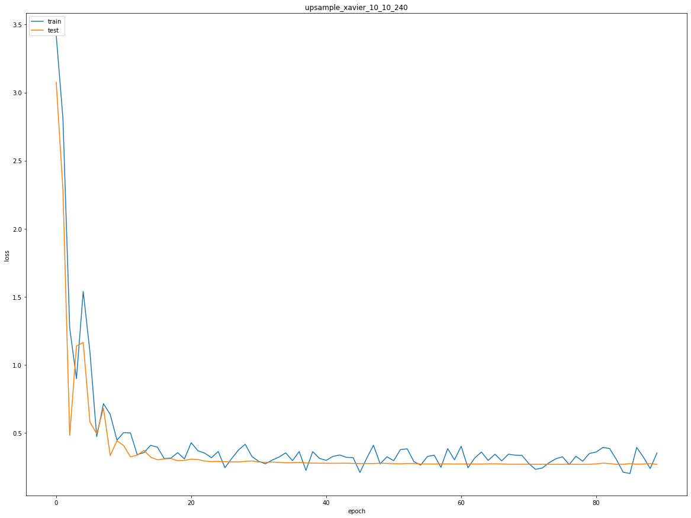

Figure 12: learning curve of U-net on the TACO dataset,the validation loss converges around 0.3.

Unsure if perhaps something had gone wrong in adapting the implementation we tried to overfit the network on a single image, which did work. The network was completely able to reproduce a single output, as can be seen in Figure 13. The top image is the original label, the bottom is the network prediction after overfitting of a dataset of only this image (due to the unpadded convolutions, the output is cropped to some extent).

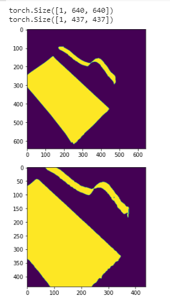

Figure 13: Segmentation mask produced by U-Net overfit one a single image. The top image is the ground-truth segmentation mask, the bottom image is the network prediction.

At first we tried to remedy this issue using different optimizers during training, such as Adadelta, but to no avail. Tweaking the learning rate and the learning rate scheduler did not change the all-background predictions into anything more meaningful either. 

At this point, we started to suspect that the large class imbalance in the dataset, combined with the large variety within classes, was hindering the learning. For example, the largest superclass, ‘Plastic bag & wrapper’, contains garbage bags, potato chips bags, transparent plastic bags and small pieces of wrapper. These are all very different yet belong to the same class, of which not too many samples were present anyway: even though it is the largest superclass, it contains a little over 400 images. In addition, in a lot of images, the annotated parts are very small, see Figure 14.

<p float="left">

  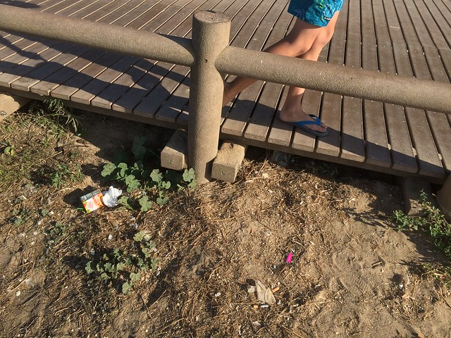

  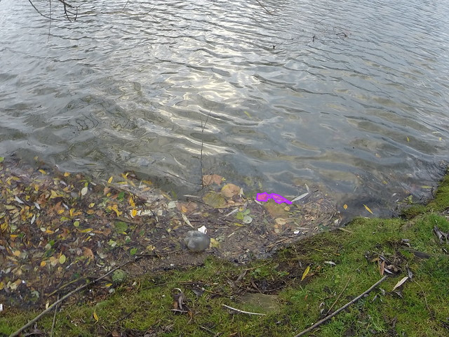

</p>

Figure 14: Examples from TACO with very small litter items.

After inspecting such images, one might see why the network would find a comfortable local minimum when predicting “all background” for each sample. We started to suspect that U-Net, with its large number of parameters was a bit too much of a beast for the delicately composed and rather small TADO dataset. We therefore augmented the dataset, using random crops and random rotations. Unfortunately, this did not help either. The validation loss continued to settle for roughly a 0.3 loss and upon inspection, all predictions on the test set would still be “all background”. Learning with data augmentation on a single class did not bring any relief either. We therefore have to conclude that the U-Net architecture, although robust, generalizable and designed for smaller datasets, is an insufficient architecture to capture the intricacies of this small dataset with large variety.


### Conclusion

After eliminating various reasons for the consistent convergence at local minima, we conclude that U-net is not fit for the task of trash detection with the TACO dataset. This is possibly due to its large number of parameters in combination with the small but versatile dataset.


# Discussion & Conclusion

Our original goal with this project was to compare the performance of three different image segmentation models on a small, imbalanced dataset, and investigate how different data augmentation techniques could help remedy the class imbalances. 

During the project, we encountered a number of issues. It turns out that training models on “non-standard” datasets is less trivial than we initially thought. Both the dataset and some of the models required quite a bit of tweaking to play nice together. Even then, comparing outputs is difficult: t-Mask R-CNN does not return training or evaluation losses, DeepLab and U-Net do not return AP metrics.

This relates to a problem with our approach: too much experimentation and not enough structure. In the beginning of our project, we were very focused on exploring the options and making the different models work with our dataset. However, this caused us to lose sight of the overall picture: how we would compare the results and how we would systematically investigate the effect of different data augmentations. It is an important lesson to draw: experimentation and exploration is important, but it must be backed up by a more structured plan.


# Recommendations

From our experiences with the TACO dataset we formulate the following recommendations:


### Add more samples to the dataset

The dataset in its current form is rather small, which is, in essence, relatively easy to remedy: add more samples. However, due to the labour-intensive annotation system, we understand that this is easier said than done. 


### Balance classes

In order to more efficiently improve the dataset than just brute-forcing in more images, we would recommend adding new annotated samples to the underrepresented classes first. For example, the battery superclass now has 2 samples, which would make that class benefit much more from additional samples than the largest superclass of 400 samples


# Future Work


### Additional models

There are many more network architectures that could possibly be suitable for learning trash detection with the TACO dataset. We have only tried three, with mixed results, so further studies would be interesting. We’d recommend the following models for further investigation: YoloV4[^18], Shift-invariant CNN[^19], SSD[^20] and RetinaNet[^21].


### Object tracking 

In order to enable a real WALL-E, one would ideally extend the segmentation to object tracking. It would be an interesting direction for future work to investigate Deep SORT[^22] for this purpose, which has proven to be very fast and can achieve frame rates up to 16 fps!


<!-- Footnotes themselves at the bottom. -->
## Notes

[^1]:
     Hoornweg, D., & Bhada-Tata, P. (2012). What a waste: a global review of solid waste management.

[^2]:
     Design, A., Shovava, Day, T., Comma, & Colorsheets, V. (2019, May 13). Chicago Has Launched a Trash-Eating River Robot That Anyone Can Pilot Remotely. Retrieved July 01, 2020, from https://mymodernmet.com/trash-collecting-robot-chicago-river/

[^3]:
     The Ocean Cleanup. (2020, June 26). Retrieved July 01, 2020, from https://theoceancleanup.com/

[^4]:
     Rooma: Vergeet stofzuigen. (n.d.). Retrieved July 01, 2020, from https://www.irobot.nl/nl-NL/roomba/i-serie

[^5]:
     Pedro F Proença, & Pedro Simões (2020). TACO: Trash Annotations in Context for Litter DetectionarXiv preprint arXiv:2003.06975.

[^6]:
     [https://cocodataset.org/#format-data](https://cocodataset.org/#format-data)

[^7]:
     Chen, L. C., Papandreou, G., Schroff, F., & Adam, H. (2017). Rethinking atrous convolution for semantic image segmentation. _arXiv preprint arXiv:1706.05587_.

[^8]:
     [https://pytorch.org/hub/pytorch_vision_deeplabv3_resnet101/](https://pytorch.org/hub/pytorch_vision_deeplabv3_resnet101/)

[^9]:
     He, K., Gkioxari, G., Dollár, P., & Girshick, R. (2017). Mask r-cnn. In _Proceedings of the IEEE international conference on computer vision_ (pp. 2961-2969).

[^10]:
     Mittal, A. (2019, June 17). Instance segmentation using Mask R-CNN. Retrieved July 01, 2020, from https://towardsdatascience.com/instance-segmentation-using-mask-r-cnn-7f77bdd46abd

[^11]:
     Ren, S., He, K., Girshick, R., & Sun, J. (2015). Faster r-cnn: Towards real-time object detection with region proposal networks. In _Advances in neural information processing systems_ (pp. 91-99).

[^12]:
     [https://github.com/pytorch/vision/blob/master/torchvision/models/detection/mask_rcnn.py](https://github.com/pytorch/vision/blob/master/torchvision/models/detection/mask_rcnn.py)

[^13]:
     [https://pytorch.org/docs/stable/data.html#torch.utils.data.DataLoader](https://pytorch.org/docs/stable/data.html#torch.utils.data.DataLoader)

[^14]:
     Ronneberger, O., Fischer, P., & Brox, T. (2015). U-net: Convolutional networks for biomedical image segmentation. In International Conference on Medical image computing and computer-assisted intervention (pp. 234–241).

[^15]:
     Yao, W., Zeng, Z., Lian, C., & Tang, H. (2018). Pixel-wise regression using U-Net and its application on pansharpeningNeurocomputing, 312, 364–371.

[^16]:
     Abdulkadir, A., Lienkamp, S., Brox, T., & Ronneberger, O. (2016). 3D U-Net: learning dense volumetric segmentation from sparse annotation. In International conference on medical image computing and computer-assisted intervention (pp. 424–432).

[^17]:
     Iglovikov, V., & Shvets, A. (2018). Ternausnet: U-net with vgg11 encoder pre-trained on imagenet for image segmentation, arXiv preprint arXiv:1801.05746.

[^18]:
     Bochkovskiy, A., Wang, C.Y., & Liao, H.Y. (2020). YOLOv4: Optimal Speed and Accuracy of Object DetectionarXiv preprint arXiv:2004.10934.

[^19]:
     Zhang, R. (2019). Making convolutional networks shift-invariant againarXiv preprint arXiv:1904.11486.

[^20]:
     Liu, W., Anguelov, D., Erhan, D., Szegedy, C., Reed, S., Fu, C.Y., & Berg, A. (2016). Ssd: Single shot multibox detector. In European conference on computer vision (pp. 21–37).

[^21]:
     Lin, T.Y., Goyal, P., Girshick, R., He, K., & Dollár, P. (2017). Focal loss for dense object detection. In Proceedings of the IEEE international conference on computer vision (pp. 2980–2988).

[^22]:
     Wojke, N., Bewley, A., & Paulus, D. (2017). Simple online and realtime tracking with a deep association metric. In 2017 IEEE international conference on image processing (ICIP) (pp. 3645–3649).
